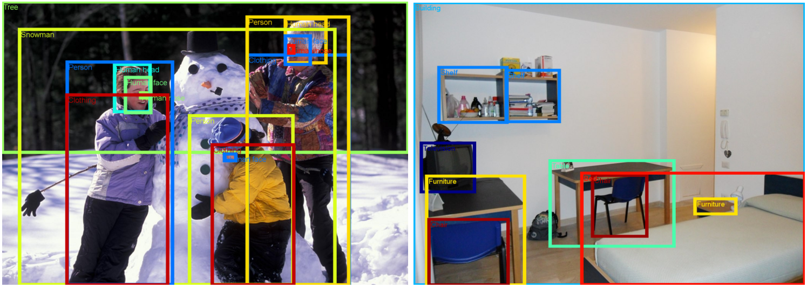
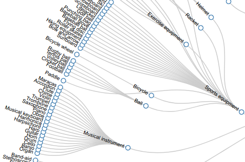
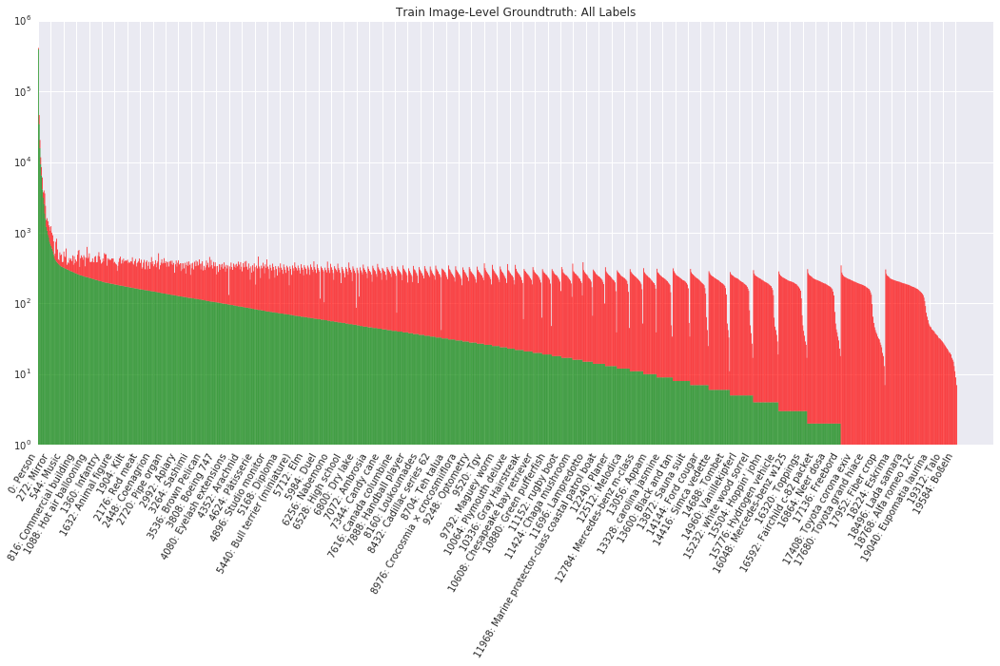
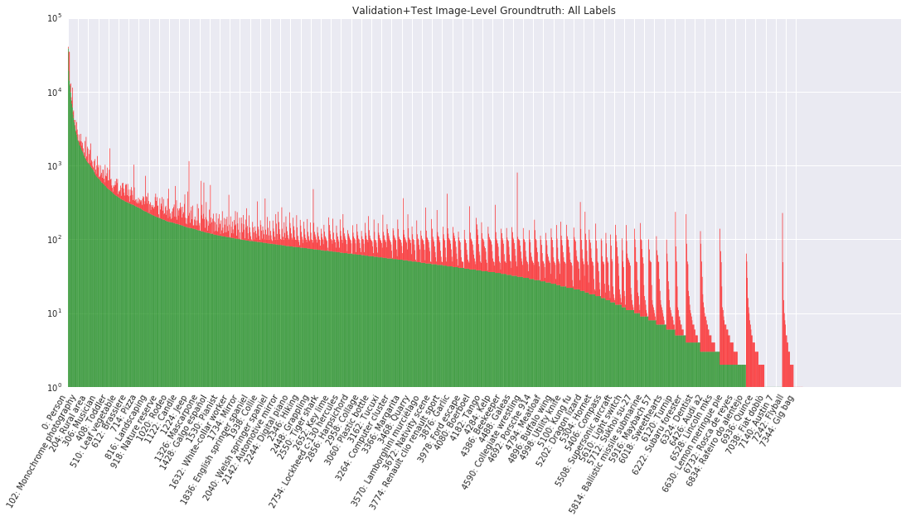
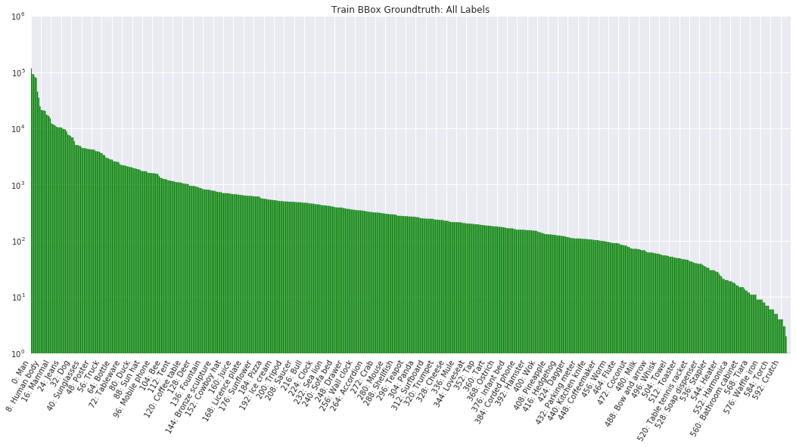
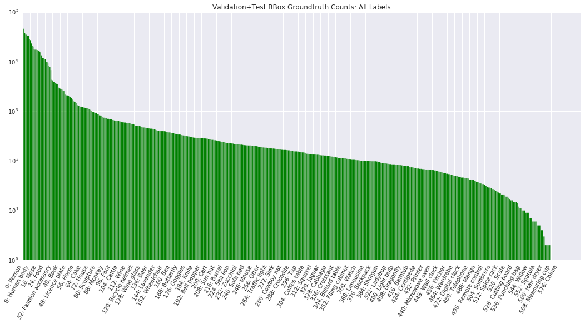

# Open Images dataset

Open Images is a dataset of ~9 million URLs to images that have been annotated with labels and bounding boxes spanning thousands categories.

The annotations are licensed by Google Inc. under [CC BY 4.0](https://creativecommons.org/licenses/by/4.0/) license. The contents of this repository are released under an [Apache 2](LICENSE) license.

The images are listed as having a [CC BY 2.0](https://creativecommons.org/licenses/by/2.0/) license. **Note:** while we tried to identify images that are licensed under a Creative Commons Attribution license, we make no representations or warranties regarding the license status of each image and you should verify the license for each image yourself.

[](http://www.cvdfoundation.org/datasets/open-images-dataset/vis)
*<sub>Annotated images from the Open Images dataset. Left: [FAMILY MAKING A SNOWMAN](https://www.flickr.com/photos/mwvchamber/5433788065) by [mwvchamber](https://www.flickr.com/photos/mwvchamber/). Right: [STANZA STUDENTI.S.S. ANNUNZIATA](https://www.flickr.com/photos/ersupalermo/5759830290) by [ersupalermo](https://www.flickr.com/photos/ersupalermo/). Both images used under [CC BY 2.0](https://creativecommons.org/licenses/by/2.0/) license.<br><b>Browse the validation set [here](http://www.cvdfoundation.org/datasets/open-images-dataset/vis)</b>, courtesy of Common Visual Data Foundation ([CVDF](http://www.cvdfoundation.org)).</sub>*

## Announcements

* **07-20-2017** V2 data is released! The dataset now includes 2M bounding boxes spanning 600 object classes (1.24M in train, 830K in validation+test), and 4.3M human-verified positive image-level labels on the training set. [Changelist](CHANGELIST-V1-TO-V2.md). Coming soon: Trained models (both image-level and object detectors).
* **07-20-2017** [V2 data visualizer](http://www.cvdfoundation.org/datasets/open-images-dataset/vis), courtesy of Common Visual Data Foundation ([CVDF](http://www.cvdfoundation.org)).

## Download the data

* [Image URLs and metadata](https://storage.googleapis.com/openimages/2017_07/images_2017_07.tar.gz) (990 MB)
* [Bounding box annotations (train, validation, and test sets)](https://storage.googleapis.com/openimages/2017_07/annotations_human_bbox_2017_07.tar.gz) (37 MB)
* [Image-level annotations (train, validation, and test sets)](https://storage.googleapis.com/openimages/2017_07/annotations_human_2017_07.tar.gz) (66 MB)
* [Machine-populated image-level annotations (train, validation, and test sets)](https://storage.googleapis.com/openimages/2017_07/annotations_machine_2017_07.tar.gz) (447 MB)
* [Classes and class descriptions](https://storage.googleapis.com/openimages/2017_07/classes_2017_07.tar.gz) (293 KB)

See also how to [import the annotations into PostgreSQL](https://github.com/openimages/dataset/wiki/Importing-into-PostgreSQL).

## Data organization

Each image has a unique 64-bit ID assigned. In the CSV files they appear as zero-padded hex integers, such as 000060e3121c7305. The [dataset](#download-the-data) is split into a training set (9011219 images), a validation set (41620 images), and a test set (125436 images)<sup>[1](#footnote1)</sup>. Each image has zero or more labels and/or bounding boxes assigned.

All images have machine-populated image-level annotations while human annotations are provided on a subset of the images (including the validation and test sets). The human annotations come from these sources:

* Human verification of machine annotations, which allows to practically eliminate false positives (but not false negatives)<sup>[2](#footnote2)</sup>.
* Crowd-sourced verification from Image Labeler: [Crowdsource app](http://play.google.com/store/apps/details?id=com.google.android.apps.village.boond), [g.co/imagelabeler](http://g.co/imagelabeler).
* Bounding boxes in the validation and test sets drawn by human operators<sup>[3](#footnote3)</sup>.
* Bounding boxes in the train set produced semi-automatically using an enhanced version of the method described in ["We don't need no bounding-boxes: Training object class detectors using only human verification", Papadopolous et al., CVPR 2016](https://arxiv.org/abs/1602.08405). These are all human verified<sup>[4](#footnote4)</sup>.

Labels are identified by MIDs (Machine-generated Ids) as can be found in [Freebase](https://en.wikipedia.org/wiki/Freebase) or [Google Knowledge Graph API](https://developers.google.com/knowledge-graph/). A short description of each class is available in [class-descriptions.csv](https://storage.googleapis.com/openimages/2017_07/class-descriptions.csv). There are 19868 distinct [image-level classes](https://storage.googleapis.com/openimages/2017_07/classes.txt) and 600 distinct classes with a [bounding box](https://storage.googleapis.com/openimages/2017_07/classes-bbox.txt) attached to at least one images. Of these, 5000 image-level labels are considered [trainable](https://storage.googleapis.com/openimages/2017_07/classes-trainable.txt) with at least 30 human-verified images in the training set and 5 images in the validation or test sets. 545 labels with bounding boxes are considered [trainable](https://storage.googleapis.com/openimages/2017_07/classes-bbox-trainable.txt).

Each annotation has a confidence number from 0.0 to 1.0 assigned. The human annotations are binary (either positive, 1.0 or negative, 0.0), while machine annotations have fractional confidences, generally, >= 0.5. The higher confidence, the smaller chance for the label to be a false positive.

The data tarballs contain the following files:

### images.csv

There's one such file for each subset inside train, validation, and test subdirectories respectively. It has image URLs, their OpenImages IDs, titles, authors and license information:

```
ImageID,Subset,OriginalURL,OriginalLandingURL,License,AuthorProfileURL,Author,Title,\
OriginalSize,OriginalMD5,Thumbnail300KURL
...
000060e3121c7305,train,https://c1.staticflickr.com/5/4129/5215831864_46f356962f_o.jpg,\
https://www.flickr.com/photos/brokentaco/5215831864,\
https://creativecommons.org/licenses/by/2.0/,\
"https://www.flickr.com/people/brokentaco/","David","28 Nov 2010 Our new house."\
211079,0Sad+xMj2ttXM1U8meEJ0A==,https://c1.staticflickr.com/5/4129/5215831864_ee4e8c6535_z.jpg
...
```

The data is as it appears on the destination websites.

* OriginalSize is the download size of the original image.
* OriginalMD5 is base64-encoded binary MD5, as described [here](https://cloud.google.com/storage/transfer/create-url-list#md5).
* Thumbnail300KURL is an optional URL to a thumbnail with ~300K pixels (~640x480). It's provided for the convenience of downloading the data in the absence of more convenient ways to get the images. If missing, the OriginalURL must be used (and then resized to the same size, if needed). **Beware:** these thumbnails are generated on the fly and their contents and even resolution might be different every day.

### annotations-machine.csv

Machine-generated image-level labels (one file each for train, validation, and test):

```
ImageID,Source,LabelName,Confidence
000002b66c9c498e,machine,/m/05_4_,0.7
000002b66c9c498e,machine,/m/0krfg,0.7
000002b66c9c498e,machine,/m/01kcnl,0.5
000002b97e5471a0,machine,/m/05_5t0l,0.9
000002b97e5471a0,machine,/m/0cgh4,0.8
000002b97e5471a0,machine,/m/0dx1j,0.8
000002b97e5471a0,machine,/m/039jbq,0.8
000002b97e5471a0,machine,/m/03nfmq,0.8
000002b97e5471a0,machine,/m/03jm5,0.7
...
```

These were generated from a computer vision model similar to
[Google Cloud Vision API](https://cloud.google.com/vision/).

### annotations-human.csv

Human-verified image-level labels (one file each for train, validation, and test):

```
ImageID,Source,LabelName,Confidence
000002b66c9c498e,human,/m/014l8n,0
000002b66c9c498e,human,/m/017ycn,0
000002b66c9c498e,human,/m/018tkd,0
000002b66c9c498e,human,/m/019_nn,1
000002b66c9c498e,human,/m/01_qs1,0
000002b66c9c498e,human,/m/01b7zv,0
000002b66c9c498e,human,/m/01bsxb,1
000002b66c9c498e,human,/m/01c5nlx,1
000002b66c9c498e,human,/m/01d07t,0
...
```

### annotations-human-bbox.csv

Human provided labels with bounding box coordinates (one file each for train,
validation, and test).

For the train set labels and box coordinates are provided:

```
ImageID,Source,LabelName,Confidence,XMin,XMax,YMin,YMax
000002b66c9c498e,human,/m/01g317,1,0.602,0.766,0.309,0.489
000002b66c9c498e,human,/m/01g317,1,0.611,0.750,0.287,0.469
000002b66c9c498e,human,/m/01mzpv,1,0.009,0.119,0.750,0.920
000002b66c9c498e,human,/m/01mzpv,1,0.019,0.098,0.767,0.892
000002b66c9c498e,human,/m/0270h,1,0.522,0.917,0.675,0.966
000002b66c9c498e,human,/m/0284d,1,0.522,0.917,0.675,0.966
000002b66c9c498e,human,/m/0284d,1,0.560,0.951,0.696,1.000
000002b66c9c498e,human,/m/02p0tk3,1,0.031,0.448,0.697,0.967
000002b66c9c498e,human,/m/02wbm,1,0.522,0.917,0.675,0.966
...
```

For the validation and test sets additional attributes are also given:

```
ImageID,Source,LabelName,Confidence,XMin,XMax,YMin,YMax,IsOccluded,IsTruncated,IsGroupOf,IsDepiction,IsInside
000e4e7ed48c932d,human,/m/05s2s,1,0.000563,1.000000,0.000000,0.999128,0,1,1,0,0
000e4e7ed48c932d,human,/m/0c9ph5,1,0.822343,1.000000,0.000000,0.222423,1,1,0,0,0
000e4e7ed48c932d,human,/m/0c9ph5,1,0.466559,0.761525,0.124262,0.560279,1,0,0,0,0
000e4e7ed48c932d,human,/m/0c9ph5,1,0.000000,0.082646,0.249817,0.386786,1,1,0,0,0
000e4e7ed48c932d,human,/m/0c9ph5,1,0.000000,0.214165,0.321725,0.683551,0,0,0,0,0
000e4e7ed48c932d,human,/m/0c9ph5,1,0.200481,0.316795,0.615067,0.728066,0,0,0,0,0
000e4e7ed48c932d,human,/m/0c9ph5,1,0.052237,0.229369,0.853620,1.000000,1,1,0,0,0
000e4e7ed48c932d,human,/m/0c9ph5,1,0.553224,0.780531,0.865034,1.000000,1,1,0,0,0
000e4e7ed48c932d,human,/m/0c9ph5,1,0.498488,0.583633,0.483805,0.542017,1,0,0,0,0
...
```

The attributes have the following definitions:

- IsOccluded: Indicates that the object is occluded by another object in the image.
- IsTruncated: Indicates that the object extends beyond the boundary of the image.
- IsGroupOf: Indicates that the box spans a group of objects (e.g., a bed of flowers or a crowd of people).
- IsDepiction: Indicates that the object is a depiction (e.g., a cartoon or drawing of the object, not a real physical instance).
- IsInside: Indicates a picture taken from the inside of the object (e.g., a car interior or inside of a building).

### class-descriptions.csv

The label MIDs can be converted to their short descriptions by looking into class-descriptions.csv:

```
...
/m/025dyy,Box
/m/025f_6,Dussehra
/m/025fh,Professor x
/m/025fnn,Savannah Sparrow
/m/025fsf,Stapler
/m/025gg7,Jaguar x-type
/m/02_5h,Figure skating
/m/025_h00,Solid-state drive
/m/025_h88,White tailed prairie dog
/m/025_hbp,Mercury monterey
/m/025h_m,Yellow rumped Warbler
/m/025khl,Spätzle
...
```

Note the presence of characters like commas and quotes. The file follows
standard csv escaping rules. E.g.,

```
/m/02wvth,"Fiat 500 ""topolino"""
/m/03gtp5,Lamb's quarters
/m/03hgsf0,"Lemon, lime and bitters"
```

### classes.txt

The list of 19868 image-level classes:

```
/m/0100nhbf
/m/0104x9kv
/m/0105jzwx
/m/0105ld7g
/m/0105lxy5
/m/0105n86x
/m/0105ts35
/m/0108_09c
/m/01_097
/m/010dmf
...
```

### classes-trainable.txt

The list of 5000 trainable image-level classes.

### classes-bbox.txt

The list of 600 box-level classes.

### classes-bbox-trainable.txt

The list of 545 trainable box-level classes.

## Statistics and data analysis

### Browse the data

- Browse the bounding box groundtruth [here](http://www.cvdfoundation.org/datasets/open-images-dataset/vis), courtesy of [CVDF](http://www.cvdfoundation.org).

- View the set of boxable labels [here](https://storage.googleapis.com/openimages/2017_07/bbox_labels_vis/bbox_labels_vis.html):

[](https://storage.googleapis.com/openimages/2017_07/bbox_labels_vis/bbox_labels_vis.html)

### Label distribution
The following figures show the distribution of annotations across the dataset<sup>[5](#footnote5)</sup>. Notice that the class distribution is heavily skewed (note: the y-axis is on a log-scale). Labels are ordered by number of positive examples, then by number of negative examples.







## Citations

If you use the OpenImages dataset in your work, please cite it as:

APA-style citation: "Krasin I., Duerig T., Alldrin N., Ferrari V., Abu-El-Haija S., Kuznetsova A., Rom H., Uijlings J., Popov S., Veit A., Belongie S., Gomes V., Gupta A., Sun C., Chechik G., Cai D., Feng Z., Narayanan D., Murphy K. OpenImages: A public dataset for large-scale multi-label and multi-class image classification, 2017. Available from https://github.com/openimages".

BibTeX
```
@article{openimages,
  title={OpenImages: A public dataset for large-scale multi-label and multi-class image classification.},
  author={Krasin, Ivan and Duerig, Tom and Alldrin, Neil and Ferrari, Vittorio and Abu-El-Haija, Sami and Kuznetsova, Alina and Rom, Hassan and Uijlings, Jasper and Popov, Stefan and Veit, Andreas and Belongie, Serge and Gomes, Victor and Gupta, Abhinav and Sun, Chen and Chechik, Gal and Cai, David and Feng, Zheyun and Narayanan, Dhyanesh and Murphy, Kevin},
  journal={Dataset available from https://github.com/openimages},
  year={2017}
}
```

---

<a name="footnote1">1</a>. The V1 validation set was partitioned into validation and test in the V2 release. This is intended to make evaluations more tractable.

<a name="footnote2">2</a>. Additional details on the human verification of image-level ground-truth:

 * The groundtruth consists of verifications of machine generated labels.
 * A variety of models were used to generate the samples (not just the one used to generate the machine-generated labels above) which is why the vocabulary is significantly expanded.

<a name="footnote3">3</a>. Additional details on the validation and test set bounding box groundtruth:

 * All object instances are annotated with a box in the validation and test sets. This includes all object classes in the machine generated image-level labels, which have been positively verified by a human. Note that false negatives of the image-level model mean there could be some labels missing.
 * Paid human operators went through a sequence of tasks that involved drawing each instance of the label in the image, assigning attributes (like IsInside), and verifying the drawn boxes.
 * All boxes in the validation and test sets are human verified.

<a name="footnote4">4</a>. Additional details on the training set bounding box groundtruth:

 * Boxes in the training set were collected using an enhanced version of the method described in ["We don't need no bounding-boxes: Training object class detectors using only human verification", Papadopolous et al., CVPR 2016](https://arxiv.org/abs/1602.08405).
 * At most one box per class per image is provided in the training set.
 * Boxes in the training set are guaranteed IoU > 0.7 with the perfect box, and in practice they are very accurate: mean IoU is ~0.8-0.85.
 * We deliberately did not annotate human body parts for 80% of the training set due to the overwhelming number of instances.

<a name="footnote5">5</a>. Green indicates positive examples while red indicates negatives.

